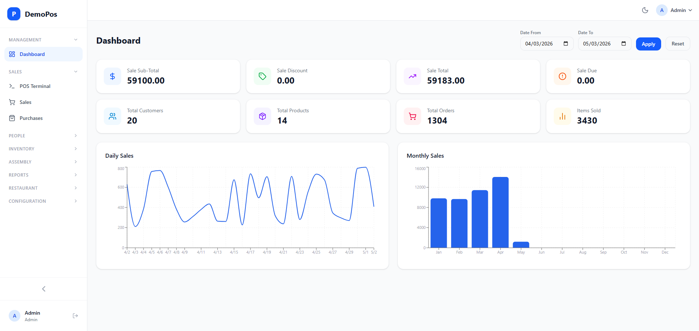
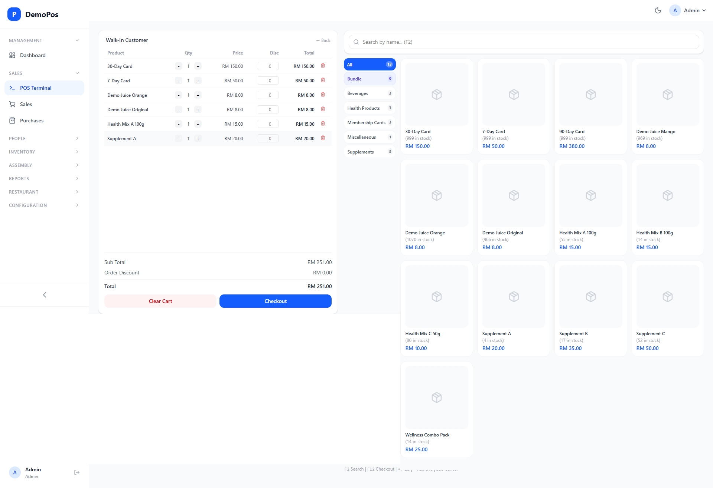
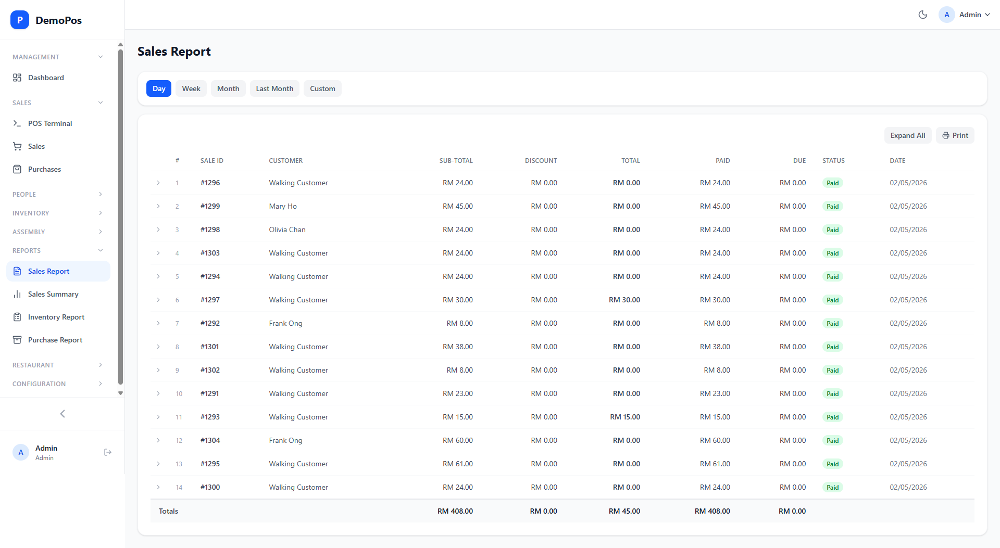

# DemoPos

A full-stack **Point of Sale (POS)** system built with **.NET 9** and **React 19**. This repository is a live demo — it ships with six months of pre-seeded showcase data so you can explore reports, charts, and workflows right after setup.

This repository was published as a single curated commit from a private development repo. Active development continues in the production deployment.

Demo Website: https://demopos-react.premiumasp.net/
| Account | Email | Password | Role |
|---|---|---|---|
| Demo | `demo@demopos.com` | `demo1234` | User (read-only) |
| Cashier | `cashier@demopos.com` | `cashier1234` | User (read-only) |
| Cashier 2 | `cashier2@demopos.com` | `cashier1234` | User (read-only) |
| Manager | `manager@demopos.com` | `manager1234` | User (read-only) |
| Staff | `staff@demopos.com` | `staff1234` | User (read-only) |

---
## Screenshots

### Admin Dashboard


### POS Terminal


### Sales Reports


## Features

| Module | Highlights |
|---|---|
| **POS Terminal** | Cart, modifiers, multi-step bundles, table / takeaway mode |
| **Sales** | Open orders, quick checkout, invoices, collection receipts, returns |
| **Purchases** | Supplier purchase orders, stock receiving, payment tracking |
| **Inventory** | Products, categories, brands, units, stock assemblies |
| **Customers & Suppliers** | Directory, purchase history, due tracking |
| **Reports** | Sales summary, profit & loss, inventory, purchase reports |
| **Settings** | Site info, invoice layout, appearance, payment methods, currencies |
| **Users & Roles** | Role-based permissions, user management |
| **Restaurant Mode** | Table management, kitchen tickets, dine-in / takeaway orders |

---

## Tech Stack

| Layer | Technology |
|---|---|
| Backend | .NET 9 · ASP.NET Core · Entity Framework Core 9 · SQL Server |
| Frontend | React 19 · Vite 7 · Tailwind CSS 4 · React Router 7 |
| Auth | JWT (httpOnly cookie) · BCrypt |

---

## Prerequisites

- [.NET 9 SDK](https://dotnet.microsoft.com/download/dotnet/9.0)
- [SQL Server](https://www.microsoft.com/en-us/sql-server/sql-server-downloads) (Express edition is fine)
- [Node.js 18+](https://nodejs.org/) with npm

---

## Setup

### 1. Clone the repository

```bash
git clone https://github.com/<your-username>/DemoPos.git
cd DemoPos
```

### 2. Configure the API

Create `demopos-api/DemoPos.Api/appsettings.json` (this file is git-ignored):

```json
{
  "ConnectionStrings": {
    "DefaultConnection": "Server=localhost;Database=DemoPos;User Id=demopos_app;Password=your_password;TrustServerCertificate=True;"
  },
  "Jwt": {
    "Key": "your-secret-key-here-must-be-at-least-32-characters",
    "Issuer": "DemoPos",
    "Audience": "DemoPos",
    "ExpiryHours": "24"
  },
  "Email": {
    "Host": "",
    "Port": "587",
    "Username": "",
    "Password": "",
    "FromEmail": "noreply@demopos.com",
    "FromName": "DemoPos System"
  },
  "App": {
    "DemoEmail": "demo@demopos.com"
  },
  "Logging": {
    "LogLevel": {
      "Default": "Information",
      "Microsoft.AspNetCore": "Warning"
    }
  },
  "Cors": {
    "AllowedOrigins": "https://localhost:3000,http://localhost:3000"
  }
}
```

> **Tip:** Alternatively, set the JWT key as an environment variable to keep it out of files:
> ```bash
> export DEMOPOS_JWT_KEY="your-secret-key-here-must-be-at-least-32-characters"
> ```

### 3. Run database migrations & start the API

```bash
cd demopos-api/DemoPos.Api
dotnet run
```

On first startup the API will:
1. Run all EF Core migrations automatically.
2. Seed roles, permissions, products, users, and **six months of showcase data** (sales, purchases, customers).

The API listens on **`https://localhost:5001`**.

### 4. Install frontend dependencies & start the dev server

Open a second terminal:

```bash
cd demopos-frontend
npm install
npm run dev
```

The frontend is available at **`https://localhost:3000`** (self-signed cert — accept the browser warning).

---

## Default Credentials

| Account | Email | Password | Role |
|---|---|---|---|
| Demo | `demo@demopos.com` | `demo1234` | User (read-only) |
| Cashier | `cashier@demopos.com` | `cashier1234` | User (read-only) |
| Cashier 2 | `cashier2@demopos.com` | `cashier1234` | User (read-only) |
| Manager | `manager@demopos.com` | `manager1234` | User (read-only) |
| Staff | `staff@demopos.com` | `staff1234` | User (read-only) |

> The demo accounts (non-admin) are read-only. Change the admin password after your first login via **Settings → Profile**.

---

## Project Structure

```
DemoPos/
├── DemoPos.sln
├── demopos-api/
│   ├── .env.example              # Environment variable reference
│   └── DemoPos.Api/
│       ├── Controllers/          # REST API controllers
│       ├── Data/
│       │   ├── AppDbContext.cs
│       │   ├── SeedData.cs       # Core seed (roles, products, settings)
│       │   └── ShowcaseSeeder.cs # 6-month demo data
│       ├── DTOs/                 # Request / response models
│       ├── Migrations/           # EF Core migrations
│       ├── Models/               # Entity models
│       ├── Services/             # Business logic (Abstraction + Implementation)
│       ├── Middleware/           # Error handling
│       ├── Mappings/             # AutoMapper profiles
│       ├── Program.cs
│       └── appsettings.Development.json
└── demopos-frontend/
    ├── src/
    │   ├── api/                  # Axios API client modules
    │   ├── components/           # Shared UI components
    │   ├── context/              # Auth, Currency, POS, Theme contexts
    │   ├── layouts/              # App and Auth layouts
    │   ├── pages/                # Feature pages (pos, sales, reports, …)
    │   └── routes/               # Private / Public route guards
    ├── tests/                    # Playwright E2E tests
    ├── vite.config.js
    └── package.json
```

---

## Running E2E Tests (Playwright)

Make sure both the API and frontend are running, then:

```bash
cd demopos-frontend
npx playwright test
```

---

## Building for Production

The `.csproj` publish target builds the React app and copies the output into `wwwroot/` automatically:

```bash
cd demopos-api/DemoPos.Api
dotnet publish -c Release -o ./publish
```

The published folder contains a self-contained API that also serves the frontend.

---

## Environment Variables

| Variable | Required | Description |
|---|---|---|
| `DEMOPOS_JWT_KEY` | Production | JWT signing key (min 32 chars). Falls back to `Jwt:Key` in `appsettings.json` for local dev. |

---

## Showcase Data

The `ShowcaseSeeder` generates six months of realistic data on first run:

- **20 named customers** (plus a "Walking Customer" for anonymous sales)
- **24 purchase orders** spread across four suppliers (~1 per week)
- **~1 000 sales** with a natural growth trend, weekend spikes, and a realistic product mix
- Payment mix: ~55% cash · ~30% QR · ~15% card
- **Cash rounding** enabled (quantum 0.05) — all sale totals are rounded to the nearest 5 cents
- **10 restaurant tables** with dine-in orders (~15% of sales) and takeaway orders (~20%)
- **Stock assembly runs**: production and split templates demonstrating the assembly module

This data is visible immediately in the **Dashboard**, **Reports**, **Sales**, and **Inventory** pages.
